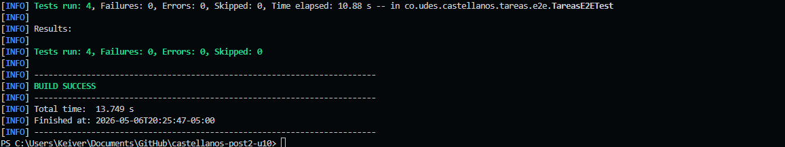
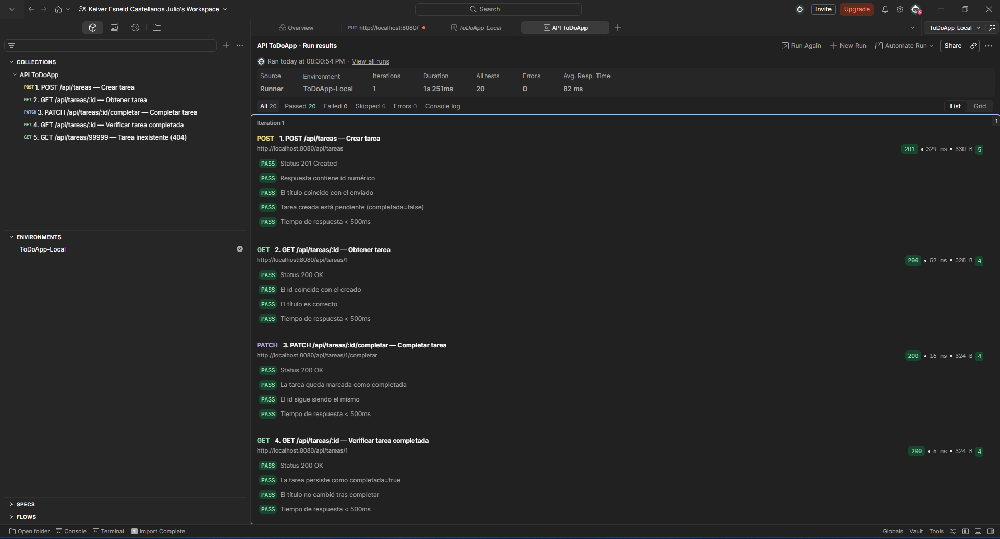
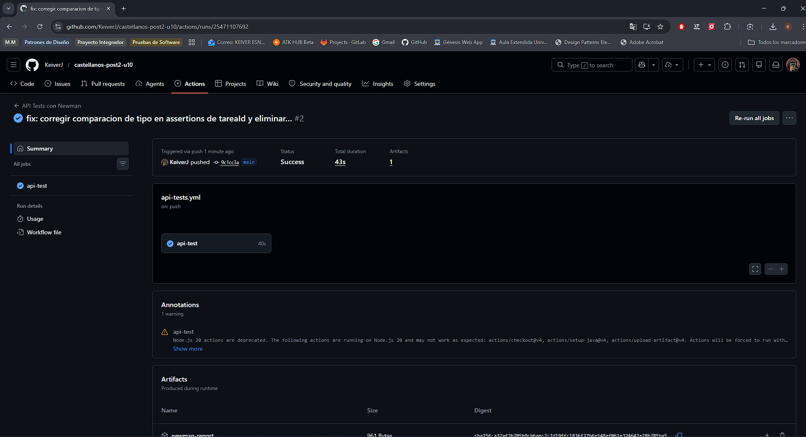

# castellanos-post2-u10

**Pruebas E2E con Selenium, Postman y Newman**  
Programación Web — Unidad 10, Post-Contenido 2  
Ingeniería de Sistemas · UDES 2026

---

## Objetivo

Implementar pruebas de extremo a extremo aplicando el patrón **Page Object Model** con Selenium WebDriver, diseñar y ejecutar una colección de pruebas de API REST en Postman con test scripts, y automatizar la ejecución mediante **Newman** integrado en un pipeline de **GitHub Actions**.

---

## Tecnologías y versiones

| Herramienta      | Versión      | Rol en el proyecto                      |
| ---------------- | ------------ | --------------------------------------- |
| Java             | 21 (Temurin) | Lenguaje de la aplicación y los tests   |
| Spring Boot      | 3.2.5        | Framework web (REST + Thymeleaf)        |
| Maven            | 3.9.x        | Gestión de dependencias y build         |
| Selenium Java    | 4.18.1       | Automatización del navegador (E2E)      |
| WebDriverManager | 5.8.0        | Descarga automática del ChromeDriver    |
| Google Chrome    | estable      | Navegador para los tests headless       |
| Postman Desktop  | v10+         | Diseño y ejecución de pruebas de API    |
| Newman           | latest (npm) | Ejecución de colecciones Postman en CLI |
| GitHub Actions   | —            | Pipeline de integración continua (CI)   |
| H2 Database      | runtime      | Base de datos en memoria para tests     |

---

## Arquitectura del proyecto

```
castellanos-post2-u10/
├── src/
│   ├── main/
│   │   ├── java/co/udes/castellanos/tareas/
│   │   │   ├── TareasApplication.java        ← Arranque Spring Boot
│   │   │   ├── controller/
│   │   │   │   ├── TareaController.java      ← REST API (/api/tareas)
│   │   │   │   └── VistaController.java      ← Vistas MVC (/tareas)
│   │   │   ├── service/
│   │   │   │   └── TareaService.java
│   │   │   ├── repository/
│   │   │   │   └── TareaRepository.java
│   │   │   ├── entity/
│   │   │   │   └── Tarea.java
│   │   │   └── exception/
│   │   │       └── TareaNotFoundException.java
│   │   └── resources/
│   │       ├── templates/
│   │       │   ├── tareas.html               ← Vista lista (/tareas)
│   │       │   └── nueva-tarea.html          ← Formulario (/tareas/nueva)
│   │       └── application.properties
│   └── test/
│       └── java/co/udes/castellanos/tareas/
│           └── e2e/
│               ├── TareasPage.java           ← Page Object lista
│               ├── NuevaTareaPage.java       ← Page Object formulario
│               └── TareasE2ETest.java        ← 4 tests E2E Selenium
├── postman/
│   ├── ColeccionToDo.json                    ← Colección Postman (5 requests)
│   ├── env-local.json                        ← Entorno local
│   └── env-ci.json                           ← Entorno CI
├── .github/
│   └── workflows/
│       └── api-tests.yml                     ← Pipeline GitHub Actions
├── capturas/                                 ← Evidencias para la rúbrica
└── pom.xml
```

---

## Prerrequisitos

- **Java 21** instalado y en el PATH (`java -version`)
- **Maven 3.9+** instalado y en el PATH (`mvn -version`)
- **Google Chrome** versión estable instalada
- **Node.js 18+** con npm (`node -v`)
- **Newman** instalado globalmente: `npm install -g newman`
- **Postman Desktop v10+** (para ejecutar el Checkpoint 2 visualmente)

---

## Ejecución paso a paso

### 1. Clonar el repositorio

```bash
git clone https://github.com/KeiverJ/castellanos-post2-u10.git
cd castellanos-post2-u10
```

### 2. Compilar el proyecto

```bash
mvn clean package -DskipTests
```

### 3. Checkpoint 1 — Tests E2E con Selenium (headless)

> **Requisito:** Google Chrome instalado en el sistema.

```bash
mvn test
```

Los 4 tests en `TareasE2ETest` se ejecutan con Chrome en modo headless.  
Salida esperada: `BUILD SUCCESS` con `Tests run: 4, Failures: 0, Errors: 0`.

### 4. Checkpoint 2 — Postman Runner

1. Abrir **Postman Desktop**
2. Importar `postman/ColeccionToDo.json`
3. Importar `postman/env-local.json` y seleccionarlo como entorno activo
4. Asegurarse de que la app está corriendo: `java -jar target/*.jar`
5. Abrir el **Runner** de Postman y ejecutar la colección `API ToDoApp`
6. Verificar: `0 failures` en los 5 requests

### 5. Checkpoint 2 — Newman en local

```bash
# Iniciar la aplicación en segundo plano
java -jar target/*.jar &

# Ejecutar la colección con Newman
newman run postman/ColeccionToDo.json --environment postman/env-local.json
```

### 6. Checkpoint 3 — GitHub Actions

El workflow `.github/workflows/api-tests.yml` se activa automáticamente en cada **push** o **pull request**.  
Verificar en la pestaña **Actions** del repositorio que el job `api-test` tiene estado ✅.

Para forzar la ejecución manualmente:

```bash
git add .
git commit -m "feat: agregar pruebas E2E y colección Postman"
git push origin main
```

---

## Endpoints de la API REST

| Método | Ruta                         | Descripción                  | Status esperado |
| ------ | ---------------------------- | ---------------------------- | --------------- |
| GET    | `/api/tareas`                | Listar todas las tareas      | 200 OK          |
| GET    | `/api/tareas/{id}`           | Obtener tarea por ID         | 200 / 404       |
| POST   | `/api/tareas`                | Crear nueva tarea            | 201 Created     |
| PATCH  | `/api/tareas/{id}/completar` | Marcar tarea como completada | 200 OK          |
| GET    | `/actuator/health`           | Health check para CI         | 200 OK          |

---

## Descripción de los checkpoints

### Checkpoint 1 — Page Object Model con Selenium

Se implementaron dos Page Objects en `src/test/java/co/udes/castellanos/tareas/e2e/`:

| Clase            | Selectores encapsulados (By)                                |
| ---------------- | ----------------------------------------------------------- |
| `TareasPage`     | `By.id("btn-nueva")`, `By.cssSelector(".tarea-item")`, etc. |
| `NuevaTareaPage` | `By.id("input-titulo")`, `By.id("btn-guardar")`, etc.       |

**4 tests implementados:**

| Test                                   | Descripción                                       |
| -------------------------------------- | ------------------------------------------------- |
| `paginaTareas_cargaCorrectamente`      | Verifica el título de la página                   |
| `botonNuevaTarea_estaVisible`          | Verifica que el botón de nueva tarea está visible |
| `navegarANuevaTarea_muestraFormulario` | Navega y verifica el formulario                   |
| `crearTarea_apareceEnLaLista`          | Crea una tarea y la verifica en la lista          |

### Checkpoint 2 — Colección Postman

La colección `API ToDoApp` contiene 5 requests ejecutados en orden:

| #   | Request                                 | Verificaciones                                                     |
| --- | --------------------------------------- | ------------------------------------------------------------------ |
| 1   | POST /api/tareas                        | Status 201, campo `id`, título, `completada=false`, tiempo < 500ms |
| 2   | GET /api/tareas/{{tareaId}}             | Status 200, id correcto, título correcto                           |
| 3   | PATCH /api/tareas/{{tareaId}}/completar | Status 200, `completada=true`                                      |
| 4   | GET /api/tareas/{{tareaId}}             | Status 200, `completada=true` persiste                             |
| 5   | GET /api/tareas/99999                   | Status 404, mensaje contiene id                                    |

La variable `tareaId` se guarda automáticamente con `pm.collectionVariables.set()`.

### Checkpoint 3 — GitHub Actions

El workflow `api-tests.yml` ejecuta:

1. `actions/checkout@v4`
2. `actions/setup-java@v4` — Java 21 Temurin
3. `mvn -B package -DskipTests` — compila el JAR
4. `java -jar target/*.jar &` — inicia la app en background
5. Espera activa con `curl` en `/actuator/health` (máx. 20 intentos × 3s)
6. `npm install -g newman`
7. `newman run` con reporte JUnit exportado a `target/newman-report.xml`

---

## Decisiones técnicas

| Decisión                          | Justificación                                                                                 |
| --------------------------------- | --------------------------------------------------------------------------------------------- |
| H2 en memoria                     | Elimina dependencia de MySQL externo en CI; el esquema se crea en cada arranque               |
| Thymeleaf para la vista `/tareas` | Permite tener una página HTML real que Selenium puede navegar con selectores estables         |
| `By.id` y `By.cssSelector`        | Selectores robustos según la rúbrica; evitan fragilidad de XPath absoluto                     |
| `WebDriverManager`                | Descarga automáticamente el chromedriver compatible; sin configuración manual                 |
| Spring Actuator                   | El endpoint `/actuator/health` permite al pipeline verificar que la app arrancó correctamente |
| `--headless` en Chrome            | Permite ejecutar en entornos sin pantalla (CI) sin modificar los tests                        |
| Newman + reporte JUnit            | Integración nativa con GitHub Actions para mostrar resultados en la pestaña Tests             |

---

## Evidencias

### Evidencia 1 — Tests de Selenium en verde

> Captura de `mvn test` con los 4 tests E2E en BUILD SUCCESS.



### Evidencia 2 — Postman Runner con 0 failures

> Captura del Postman Runner mostrando los 5 requests con 0 failures.



### Evidencia 3 — GitHub Actions con check verde

> Captura del workflow `api-tests.yml` con estado passing en la pestaña Actions.



---

## Solución de problemas frecuentes

| Problema                             | Causa probable                       | Solución                                                                                    |
| ------------------------------------ | ------------------------------------ | ------------------------------------------------------------------------------------------- |
| `SessionNotCreatedException`         | ChromeDriver incompatible con Chrome | WebDriverManager lo resuelve automáticamente; actualizar Chrome si persiste                 |
| `Connection refused` en tests        | App no está corriendo en 8080        | Verificar que no haya otro proceso usando el puerto: `netstat -ano \| findstr 8080`         |
| `404` en `/actuator/health`          | Actuator no configurado              | Verificar `application.properties` tiene `management.endpoints.web.exposure.include=health` |
| Newman `Error: connect ECONNREFUSED` | App no inició antes de Newman        | Aumentar reintentos en el paso de health-check del workflow                                 |
| Tests Selenium lentos                | Timeout muy bajo                     | Los `WebDriverWait` ya tienen 10s de espera; suficiente para headless local                 |

---

## Estructura del repositorio (mínimo 3 commits)

```
feat: agregar estructura base del proyecto y dependencias Selenium
feat: implementar Page Objects TareasPage y NuevaTareaPage con tests E2E
feat: agregar colección Postman y workflow de GitHub Actions con Newman
docs: documentar README con instrucciones y evidencias de checkpoints
```
